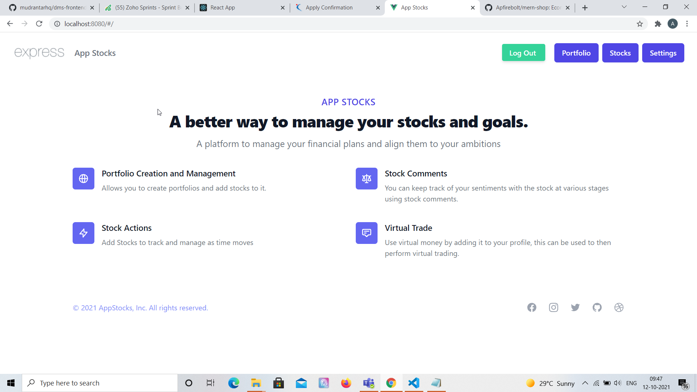
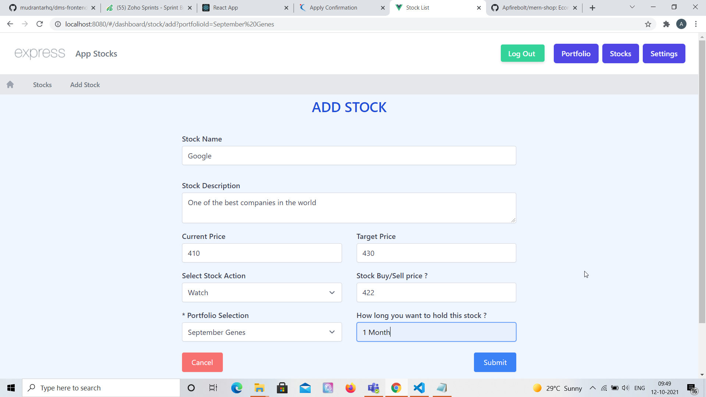
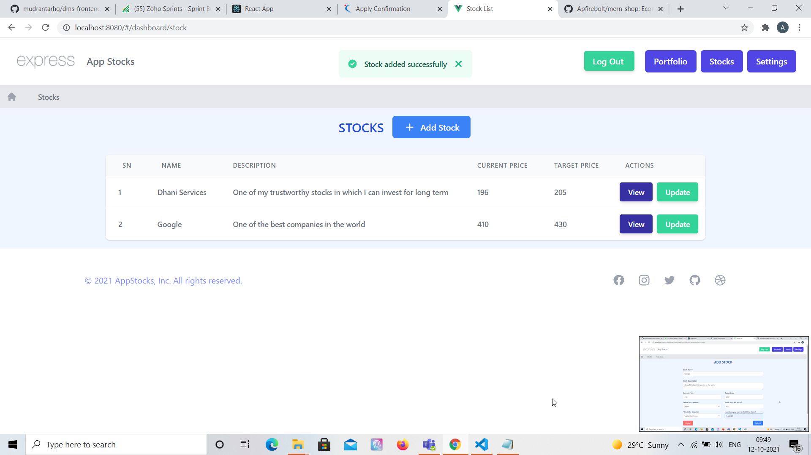
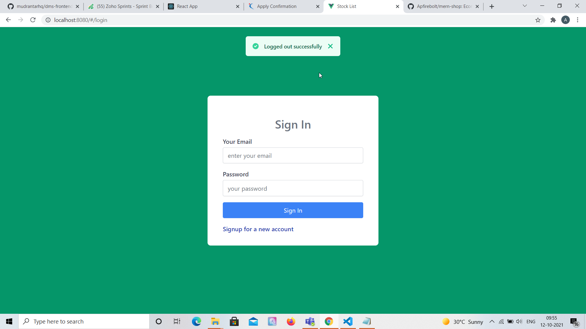
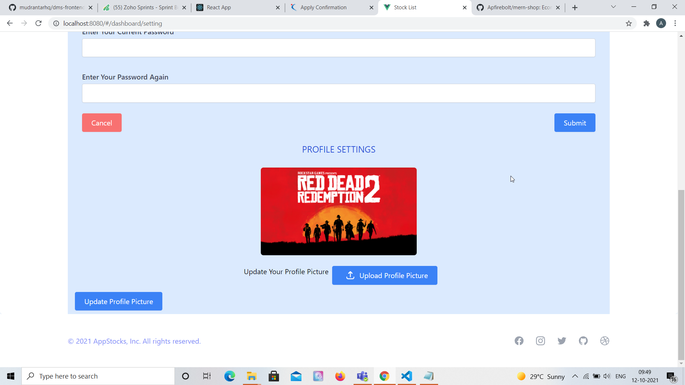
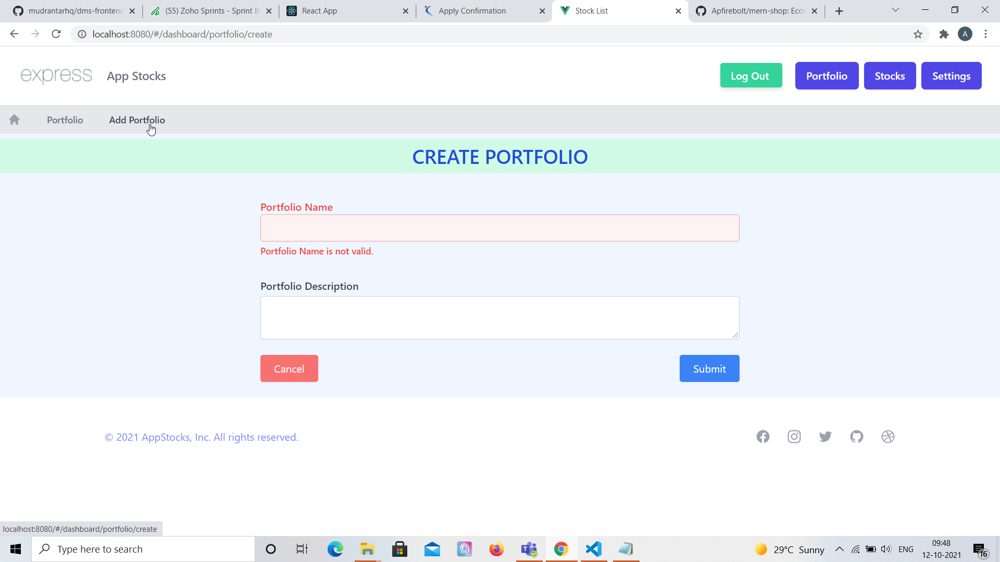
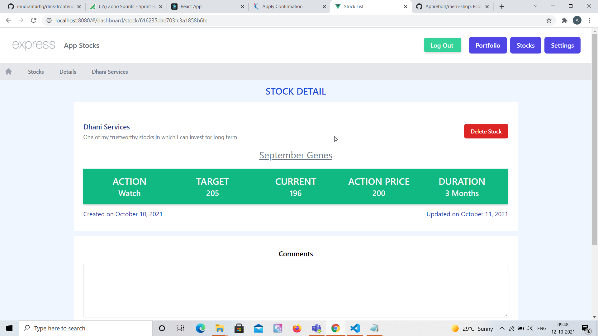

# AppStocks - A virtual stock trading web application

## Project Briefing

This is a stock trading app I built to keep track of portfolios and stocks to manage. It's created in one of the most popular full stack technologies combination known as MEVN. 

## Features

- Contains token based user auth system. 
- Each user can perform CRUD on Portfolio.
- Stocks can be added to a portfolio and can be associated with different stock actions.
- Profile settings is provided where you can add balance, change profile settings and profile image.
## Built With

* [Express](https://expressjs.com/)
* [Vue](https://vuejs.org/)
* [MongoDB](https://www.mongodb.com/)
* [Vuex](https://vuex.vuejs.org/)
* [Tailwind CSS](https://tailwindcss.com/)

## Authors

* **Amit Prafulla (APFirebolt)** - (http://amitprafull.com/)

## Project setup

Simply install node modules for both frontend and backend, the project is already configured to serve build content files in production which is generated by Vue which resides inside the build folder.

Concurrently, package is used for development and allows us to launch both frontend and back-end in one go using single command. Proxy is used for API calls made to the Express server inside the Vue application using the config file.

```
npm install
npm run dev
```

For production, build the frontend of the app and then run the backend app only. 

```
npm run build
npm start
```

The entire app can be served through Nginx after build using proxy pass. The following sample code illustrates this and assumes the back-end app is running on port 5000 in production mode.

```
user www-data;
worker_processes auto;
pid /run/nginx.pid;
include /etc/nginx/modules-enabled/*.conf;

events {
    worker_connections 768;
    # multi_accept on;
}

http {
    server {
    listen 80;
    listen [::]:80;

    location / {
        proxy_pass http://localhost:5000/;
    }
  }
}

```

## Project Screenshots

Please find some of the screenshots of the application. Below is the screenshot of the Home Page.



Please find some of the screenshots of the application. Below is the screenshot of the Add Stock Page.



Response after the stock is added successfully.



Login page.



Profile settings page.



Portfolio page.



Stock detail page.


